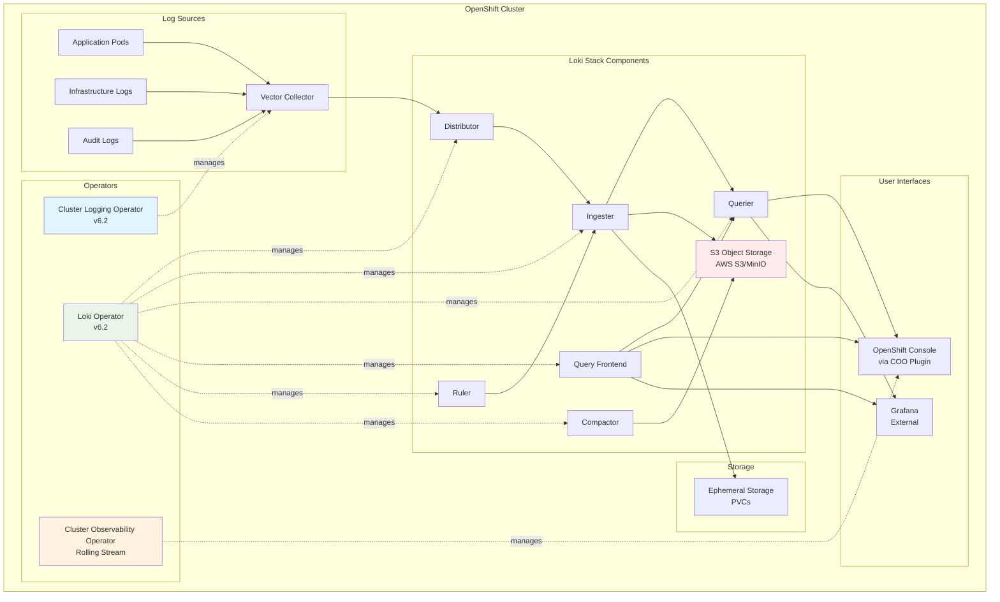

# ADR-0001: Adopt a Loki-Centric Logging Architecture

## Status
Proposed

## Context
The project is migrating from an EFK (Elasticsearch, Fluentd, Kibana) stack to a modern, modular logging architecture centered on Grafana Loki. This change is driven by the need for scalable, resource-efficient, and cloud-native logging on OpenShift 4.18+, as described in research.md and required by PRD.md. 

**Strategic Rationale**: Red Hat has officially deprecated Elasticsearch and Fluentd for new OpenShift Logging installations, recommending Vector and LokiStack as the strategic path forward. This transition represents a fundamental shift from full-text indexing to an "index-free" approach that indexes only metadata labels while storing compressed log chunks in object storage.

**Performance Validation**: Red Hat benchmarks demonstrate that a properly configured Loki deployment can handle ingestion rates of up to 4TB per day with consistently low response times. The architectural efficiency gains come from Loki's label-based indexing strategy, which dramatically reduces CPU, memory, and storage consumption compared to traditional full-text indexing approaches.

## Decision
Adopt Grafana Loki as the core log storage and query backend, replacing Elasticsearch. Use the Loki Operator for lifecycle management, and structure the stack around modular operators for log collection (Cluster Logging Operator), storage (Loki Operator), and visualization (Cluster Observability Operator). All configuration will be managed declaratively via Kubernetes Custom Resources and GitOps workflows.

**Operator Compatibility**: For OpenShift 4.18.21, deploy Loki Operator v6.2 and Cluster Logging Operator v6.2, which follow the Platform Aligned support model with full support until August 16, 2025, and maintenance support until August 25, 2026. The Cluster Observability Operator follows a Rolling Stream model requiring continuous upgrades.

**Implementation Approach**: Use Vector as the log collector (deployed by CLO), LokiStack for storage (managed by Loki Operator), and the Cluster Observability Operator for unified console integration.

## Architecture Overview

## Consequences
- Dramatically reduced resource usage (CPU, memory, storage)
- Faster log ingestion and simplified operations
- Lower operational cost and improved scalability
- Requires new operational knowledge and migration effort
- Full-text search is deferred to query time, which may impact some workflows

## Alternatives Considered
- Continue with EFK stack (Elasticsearch, Fluentd, Kibana)
- Use third-party SaaS logging solutions

## Evidence
* research.md: architectural overview and operator separation
* PRD.md: business and technical goals for scalable, efficient logging
* kustomize overlays and YAML manifests: implementation evidence
* [Red Hat OpenShift Logging Documentation](https://docs.openshift.com/container-platform/latest/logging/cluster-logging.html)
* [Grafana Loki Documentation](https://grafana.com/docs/loki/latest/)
* [OpenShift Logging Operator GitHub](https://github.com/openshift/cluster-logging-operator)
* [Loki Operator GitHub](https://github.com/grafana/loki-operator)
