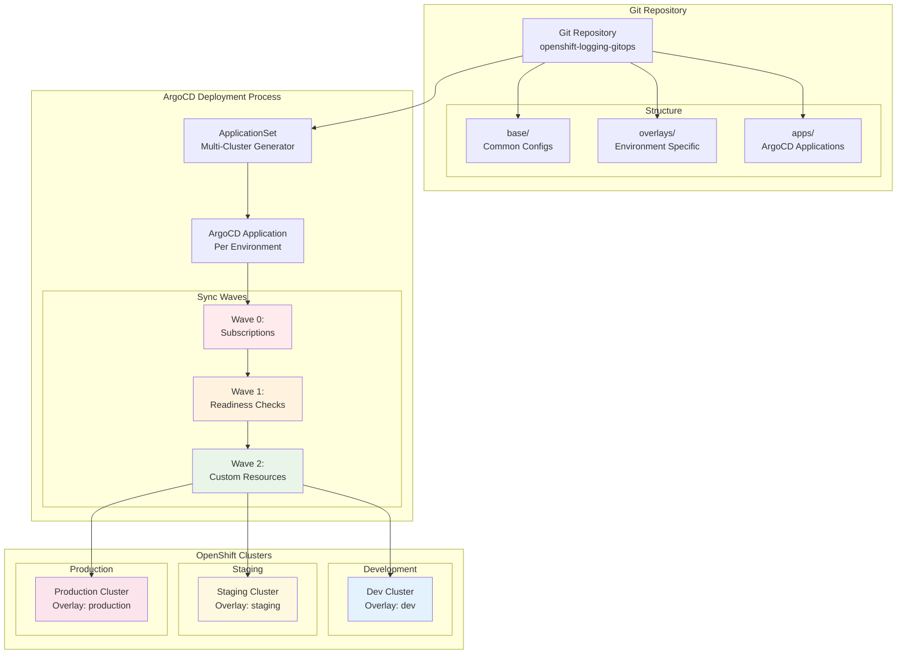

# ADR-0002: Declarative GitOps-Driven Configuration Management

## Status
Accepted (Updated by ADR-0008)

## Context
The project requires consistent, auditable, and scalable management of infrastructure and application configuration across multiple environments. The Product Requirements Document (PRD.md) specifies GitOps and Kustomize as core strategies. The current structure uses ArgoCD and Kustomize overlays for declarative configuration, enabling version-controlled, repeatable deployments.

## Decision
Adopt GitOps as the primary configuration management approach, using ArgoCD for continuous delivery and Kustomize overlays for environment-specific configuration. All changes are managed via version control and applied declaratively, ensuring that the desired state is always reflected in the cluster.

**Advanced Deployment Patterns**: Implement ArgoCD Sync Waves and Hooks to solve operator race conditions. Use a three-stage deployment process: (1) Operator Subscription (wave 0), (2) Readiness Check Job (wave 1), (3) Custom Resources (wave 2). This ensures operators are fully installed before their CRDs are applied.

**Multi-Cluster Management**: Use ArgoCD ApplicationSets with Cluster generators for automated deployment across multiple clusters, enabling policy-driven rollouts based on cluster labels and placement policies.

## GitOps Workflow

## Consequences
- Ensures configuration consistency and auditability
- Enables safe, repeatable multi-environment deployments
- Requires team discipline and GitOps expertise
- Increases reliance on Git and ArgoCD availability

## Alternatives Considered
- Manual or imperative configuration management
- Non-GitOps tools or ad-hoc scripts

## Evidence
- PRD.md: GitOps and Kustomize strategy
- apps/, overlays/, and kustomization.yaml files: implementation evidence
- [ArgoCD Documentation](https://argo-cd.readthedocs.io/en/stable/)
- [Kustomize Documentation](https://kubectl.docs.kubernetes.io/references/kustomize/)
