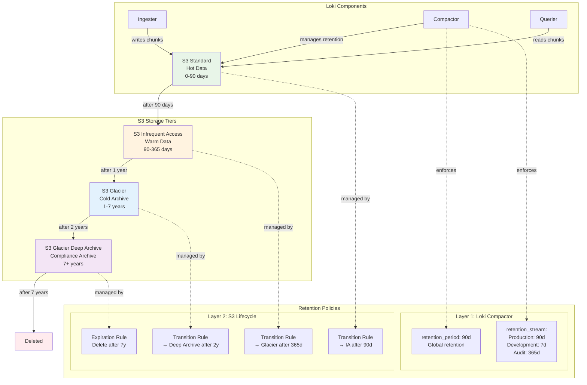

# ADR-0003: Object Storage Selection for Log Retention

## Status
Accepted

## Context
Persistent log storage is required for compliance, troubleshooting, and analytics. The Loki Operator supports various object storage backends, including AWS S3, Google Cloud Storage, and on-premises solutions like MinIO. The choice of backend impacts cost, scalability, and integration complexity.

## Decision
Standardize on S3-compatible object storage for Loki log retention. Prefer AWS S3 in cloud environments and MinIO for on-premises or disconnected clusters. Ensure all configurations use the S3 API for maximum portability.

**Implementation Details**: Create Kubernetes Secrets in the openshift-logging namespace with required keys: access_key_id, access_key_secret, bucketnames, endpoint, and region. Configure LokiStack CR with spec.storage section referencing the secret and appropriate storageClassName for ephemeral storage.

**Multi-Tiered Retention Strategy**: Implement a two-layer approach combining Loki's internal retention (managed by the Compactor with configurable retention_period and retention_stream policies) with S3 Lifecycle Policies for automated archival to cheaper storage classes (e.g., Glacier Deep Archive) and compliance-driven expiration.

## Storage Architecture

## Consequences
- Enables scalable, cost-effective log retention
- Simplifies migration between cloud and on-premises
- Introduces dependency on S3 API compatibility
- Requires secure management of storage credentials

## Alternatives Considered
- Use block storage (PVCs) for log retention
- Use vendor-specific APIs

## Supporting Evidence
- Loki documentation: object storage backends
- OpenShift docs: storage best practices
- research.md: storage comparison and benchmarks

## References
- [Loki Storage Backends](https://grafana.com/docs/loki/latest/storage/)
- [MinIO Documentation](https://min.io/docs/minio/linux/index.html)
- [OpenShift Storage Docs](https://docs.openshift.com/container-platform/latest/storage/understanding-persistent-storage.html)
