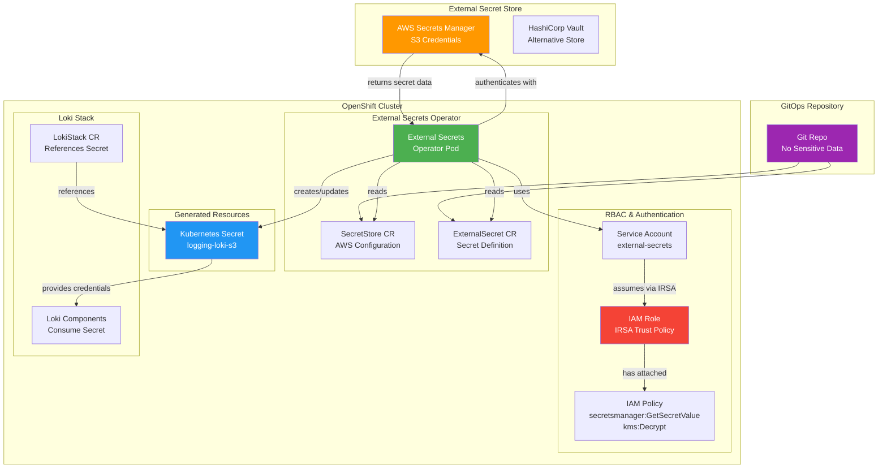

# ADR-0004: Secure Management of Secrets and Credentials

## Status
Accepted

## Context
The logging stack requires access to sensitive credentials for storage backends, cloud APIs, and internal services. Manual secret management is error-prone and does not scale. Kubernetes-native solutions like External Secrets Operator and OpenShift's built-in secret management provide automation, RBAC, and integration with external secret stores (e.g., AWS Secrets Manager, HashiCorp Vault).

## Decision
Adopt the External Secrets Operator for managing all sensitive credentials in the logging stack. Integrate with external secret stores where available, and use Kubernetes secrets as the delivery mechanism to workloads. Enforce RBAC and audit logging for all secret access.

**Implementation Process**: Follow a three-step declarative process: (1) Deploy External Secrets Operator via Subscription, (2) Create SecretStore or ClusterSecretStore CRs defining provider and authentication, (3) Create ExternalSecret CRs specifying target Kubernetes secrets to be managed.

**AWS Integration**: Use IAM Roles for Service Accounts (IRSA) as the recommended authentication method for AWS environments. Configure least-privilege IAM policies granting only necessary permissions (secretsmanager:GetSecretValue, kms:Decrypt for KMS-encrypted secrets).

**Security Benefits**: Achieve complete separation of sensitive data from Git repository while maintaining full GitOps declarative management of secret lifecycle through CRDs.

## External Secrets Operator Flow

## Consequences
- Centralizes and automates secret management
- Reduces risk of credential leakage
- Adds dependency on the External Secrets Operator and external secret stores
- Requires configuration and monitoring of secret syncs

## Alternatives Considered
- Manual management of Kubernetes secrets
- Use only built-in OpenShift secret management

## Supporting Evidence
- External Secrets Operator documentation
- OpenShift docs: secret management
- research.md: secret management comparison

## References
- [External Secrets Operator](https://external-secrets.io/)
- [OpenShift Secret Management](https://docs.openshift.com/container-platform/latest/security/secrets/secrets-overview.html)
- [Kubernetes Secrets](https://kubernetes.io/docs/concepts/configuration/secret/)
