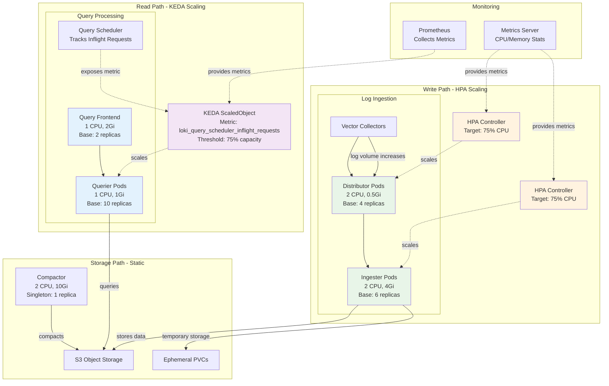

# ADR-0006: Performance Optimization and Dynamic Scaling

## Status
Proposed

## Context
Production logging systems must handle variable workloads efficiently while maintaining performance and cost-effectiveness. Research has identified specific sizing guidelines and autoscaling strategies that are critical for Loki deployments on OpenShift 4.18.21. Proper resource planning and dynamic scaling capabilities are essential for handling log volume spikes during incidents and varying query loads during investigations.

## Decision
Implement a comprehensive performance and scaling strategy based on empirically validated sizing guidelines and automated scaling mechanisms. Use different scaling approaches for write path components (ingestion) versus read path components (querying) to optimize for their distinct performance characteristics.

**Resource Sizing**: Use Grafana's validated component sizing recommendations as baseline:
- Ingester: 2 CPU cores, 4 Gi memory, 6 base replicas
- Distributor: 2 CPU cores, 0.5 Gi memory, 4 base replicas  
- Querier: 1 CPU core, 1 Gi memory, 10 base replicas
- Query-Frontend: 1 CPU core, 2 Gi memory, 2 base replicas
- Compactor: 2 CPU cores, 10 Gi memory, 1 replica (singleton)

**Write Path Scaling**: Implement standard Kubernetes HorizontalPodAutoscaler (HPA) for ingester and distributor components, scaling based on CPU utilization with target of 75%. These components show direct correlation between resource consumption and log ingestion rate.

**Read Path Scaling**: Deploy KEDA (Kubernetes Event-Driven Autoscaling) with Prometheus scaler for querier components. Scale based on `loki_query_scheduler_inflight_requests` metric with threshold calculated as 75% of total query capacity (number of queriers × workers per querier × 0.75).

## Scaling Architecture

## Resource Sizing Guidelines

| Component | CPU (Cores) | Memory (Gi) | Base Replicas | Scaling Strategy |
|-----------|-------------|-------------|---------------|------------------|
| Distributor | 2 | 0.5 | 4 | HPA (CPU 75%) |
| Ingester | 2 | 4 | 6 | HPA (CPU 75%) |
| Querier | 1 | 1 | 10 | KEDA (Custom Metric) |
| Query-Frontend | 1 | 2 | 2 | Static |
| Compactor | 2 | 10 | 1 | Static (Singleton) |

## Consequences
- Provides data-driven foundation for initial capacity planning
- Enables proactive scaling based on actual demand rather than reactive CPU/memory metrics
- Optimizes cost by scaling write and read paths independently
- Requires monitoring infrastructure and KEDA deployment
- Adds complexity in scaling configuration and troubleshooting

## Alternatives Considered
- Static resource allocation without autoscaling
- Single scaling strategy for all components
- Vendor-specific t-shirt sizes only (1x.small, 1x.medium)

## Supporting Evidence
- Grafana Loki documentation: component sizing recommendations
- Red Hat benchmarks: 4TB/day ingestion capacity validation
- KEDA documentation: Prometheus scaler for custom metrics
- Research findings: write vs. read path scaling strategies

## References
- [Grafana Loki Sizing Guide](https://grafana.com/docs/loki/latest/operations/sizing/)
- [KEDA Prometheus Scaler](https://keda.sh/docs/2.10/scalers/prometheus/)
- [Kubernetes HPA Documentation](https://kubernetes.io/docs/tasks/run-application/horizontal-pod-autoscale/)
- [Red Hat OpenShift Monitoring](https://docs.openshift.com/container-platform/latest/monitoring/monitoring-overview.html)
