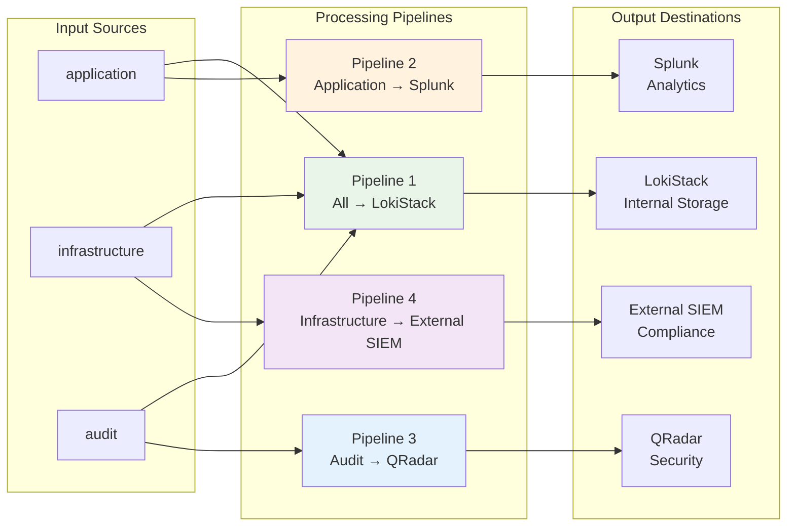

# ADR-0007: Operational Monitoring and SIEM Integration

## Status
Proposed

## Context
A production-grade logging platform requires comprehensive monitoring of its own health and performance, proactive alerting for operational issues, and integration with enterprise security systems. Research has identified specific patterns for GitOps-managed monitoring, log-based alerting, and SIEM integration that are essential for Day-2 operations of the Loki stack on OpenShift.

## Decision
Implement a comprehensive operational monitoring and integration strategy using GitOps-managed dashboards, log-based alerting with PrometheusRule CRDs, and configurable fan-out to external SIEM platforms.

**Monitoring Strategy**: Deploy Grafana dashboards declaratively via ConfigMaps with the `grafana_dashboard: "1"` label for automatic discovery by the Grafana Operator. Use the official "Loki Metrics Dashboard" (ID 17781) as the foundation, with tenant-aware filtering for application, infrastructure, and audit log streams.

**Log-Based Alerting**: Implement LogQL-based alerting using Grafana Alloy to bypass Prometheus Operator validation issues. Configure Alloy with `loki.rules.kubernetes` blocks to watch for PrometheusRule CRs labeled with `loki: "enabled"` and forward rules to the Loki Ruler API. This enables native Kubernetes workflow for log-based alerts while maintaining GitOps principles.

**SIEM Integration**: Configure ClusterLogForwarder CRs to implement fan-out architecture:
- Internal LokiStack for operational observability (developers, SREs)
- Splunk integration via HTTP Event Collector (HEC) for enterprise analytics
- Syslog integration for QRadar and other SIEM platforms
- Separate pipelines for application, infrastructure, and audit logs

**Enterprise Integration**: Use ClusterLogForwarder's flexible routing to enable different teams to consume log data in their preferred tools while maintaining centralized configuration management through GitOps.

## Monitoring and Integration Architecture

```mermaid
graph TB
    subgraph "Log Sources"
        APP[Application Logs]
        INF[Infrastructure Logs]
        AUD[Audit Logs]
    end
    
    subgraph "Log Collection & Routing"
        V[Vector Collector]
        CLF[ClusterLogForwarder<br/>Fan-out Configuration]
    end
    
    subgraph "Internal Observability"
        subgraph "Loki Stack"
            LS[LokiStack<br/>Internal Storage]
            LM[Loki Metrics<br/>Prometheus Format]
        end
        
        subgraph "Monitoring"
            P[Prometheus<br/>Scrapes Loki Metrics]
            G[Grafana<br/>Dashboard ID 17781]
            AM[AlertManager<br/>Receives Alerts]
        end
        
        subgraph "Alerting"
            GA[Grafana Alloy<br/>Loki Rules Processor]
            PR[PrometheusRule CRD<br/>label: loki="enabled"]
            LR[Loki Ruler<br/>Executes LogQL]
        end
    end
    
    subgraph "External SIEM Integration"
        SP[Splunk<br/>HEC Endpoint]
        QR[IBM QRadar<br/>Syslog Receiver]
        ES[External SIEM<br/>Custom Integration]
    end
    
    subgraph "GitOps Management"
        GIT[Git Repository<br/>Declarative Config]
        CM[ConfigMap<br/>grafana_dashboard="1"]
    end
    
    APP --> V
    INF --> V
    AUD --> V
    
    V --> CLF
    CLF --> |pipeline 1| LS
    CLF --> |pipeline 2| SP
    CLF --> |pipeline 3| QR
    CLF --> |pipeline 4| ES
    
    LS --> |exposes| LM
    LM --> P
    P --> G
    P --> AM
    
    GIT --> CM
    CM --> |auto-discovered| G
    GIT --> PR
    GA --> |watches| PR
    GA --> |forwards rules| LR
    LR --> |fires alerts| AM
    LR --> |queries| LS
    
    style LS fill:#e8f5e8
    style SP fill:#ff9800,color:#fff
    style QR fill:#2196f3,color:#fff
    style G fill:#f44336,color:#fff
    style PR fill:#9c27b0,color:#fff
    style CLF fill:#4caf50,color:#fff
```

## Log Routing Strategy



## Consequences
- Enables proactive monitoring and alerting for the logging infrastructure
- Provides enterprise-grade SIEM integration while maintaining operational simplicity
- Requires Grafana Alloy deployment and configuration
- Adds complexity in managing multiple log destinations and routing rules
- Enables compliance with security and audit requirements

## Alternatives Considered
- Manual dashboard and alert management
- Single destination logging without fan-out
- Direct SIEM forwarding without internal storage

## Supporting Evidence
- Grafana Labs dashboard recommendations and best practices
- OpenShift documentation: ClusterLogForwarder configuration
- Grafana Alloy documentation: Loki rules integration
- IBM QRadar and Splunk integration patterns

## References
- [Grafana Loki Monitoring](https://grafana.com/docs/loki/latest/operations/monitoring/)
- [OpenShift Log Forwarding](https://docs.openshift.com/container-platform/latest/logging/cluster-logging-external.html)
- [Grafana Alloy](https://grafana.com/docs/alloy/latest/)
- [Splunk HEC Integration](https://docs.splunk.com/Documentation/Splunk/latest/Data/UsetheHTTPEventCollector)
