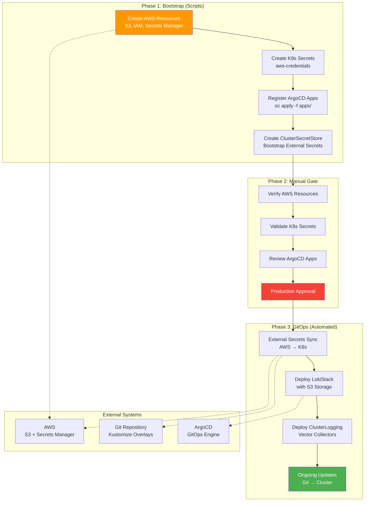

# ADR-0009: Hybrid Deployment Strategy for Production GitOps

## Status
Proposed

## Context
Real-world GitOps deployments face the challenge of managing both declarative infrastructure and secret bootstrapping. Pure GitOps approaches struggle with the "chicken and egg" problem: how do you deploy External Secrets Operator configurations when the secrets needed to authenticate to external secret stores don't exist yet?

Current industry patterns show successful hybrid approaches where:
1. **Scripts handle bootstrapping** (secrets, external resources, ArgoCD application registration)
2. **GitOps handles declarative infrastructure** (operators, configurations, instances)
3. **Manual gates exist for production** (security, compliance, change control)

The user's vision aligns with this pattern: "use scripts to deploy components to ArgoCD, manually set S3 creds for Loki, then trigger another GitOps process."

## Decision
Adopt a **Three-Phase Hybrid Deployment Strategy** that combines the reliability of scripts for bootstrapping with the power of GitOps for ongoing management.

### Phase 1: Bootstrap (Scripts)
**Purpose**: Handle one-time setup and external dependencies that cannot be stored in Git

**Components**:
- AWS S3 bucket creation and IAM setup
- Initial AWS credentials secret creation in OpenShift
- ArgoCD application registration
- External Secrets Operator ClusterSecretStore creation

**Tools**: Bash scripts with error handling and idempotency

**Implementation**: Stepped approach for improved reliability (see ADR-0017)

**Example (Monolithic - Deprecated)**:
```bash
# ./scripts/bootstrap-environment.sh production
# 1. Creates AWS resources
# 2. Creates initial k8s secret: aws-credentials
# 3. Registers ArgoCD applications: oc apply -f apps/applications/
# 4. Creates ClusterSecretStore (references aws-credentials)
```

**Example (Stepped - Recommended)**:
```bash
# Phase 1a: Deploy operators
./scripts/00-setup-operators.sh

# Phase 1b: Create AWS resources
./scripts/01-bootstrap-aws.sh production --region us-east-2

# Phase 1c: Configure TLS strategy
./scripts/02-setup-tls.sh production --tls-option b

# Phase 1d: Register ArgoCD applications
./scripts/03-register-apps.sh production
```

### Phase 2: Manual Verification & Approval (Human)
**Purpose**: Production safety gate and compliance checkpoint

**Components**:
- Verify AWS resources are created correctly
- Validate initial secrets are properly configured
- Review ArgoCD applications are registered but not yet synced
- Approve production deployment (for production environments)

**Tools**: Manual verification checklists, ArgoCD UI

**Example**:
```bash
# Manual verification steps:
oc get secret aws-credentials -n external-secrets-system
oc get clustersecretstore aws-secrets-manager
oc get applications -n openshift-gitops
# Human approval: "Proceed with GitOps sync"
```

### Phase 3: GitOps Sync (Automated)
**Purpose**: Deploy and manage all declarative infrastructure with health validation

**Components**:
- External Secrets sync from AWS Secrets Manager → Kubernetes secrets
- LokiStack deployment (references generated secrets)
- Health check job validation (Wave 1.5)
- ClusterLogForwarder deployment (Wave 3, after health check)
- Ongoing configuration management and updates

**Tools**: ArgoCD automated sync, Kustomize overlays, health check jobs

**Implementation**: Enhanced with separated applications and health checks (see ADR-0017)

**Example (Enhanced - Recommended)**:
```bash
# ./scripts/04-trigger-sync.sh production
# 1. Triggers infrastructure app sync (Wave 2)
# 2. Health check job validates LokiStack readiness (Wave 1.5)
# 3. Triggers forwarder app sync only after health check passes (Wave 3)
# 4. Monitors deployment progress with validation
```

**Example (Legacy - Deprecated)**:
```bash
# ArgoCD automatically syncs or manual trigger:
argocd app sync logging-stack-production
# GitOps takes over, manages all updates going forward
```

## Implementation Architecture



## Deployment Scripts

### Environment Bootstrap Script
```bash
#!/bin/bash
# ./scripts/bootstrap-environment.sh [environment]

deploy_to_environment() {
    local env=$1
    
    header "Phase 1: Bootstrapping $env Environment"
    
    # 1. Create AWS resources
    ./scripts/setup-s3-storage.sh "$env"
    
    # 2. Create initial K8s secrets
    ./scripts/setup-external-secrets.sh "$env"
    
    # 3. Register ArgoCD applications (but don't sync yet)
    oc apply -f "apps/applications/argocd-logging-stack-$env.yaml"
    
    # 4. Wait for External Secrets Operator to be ready
    wait_for_eso_ready
    
    header "Phase 2: Manual Verification Required"
    echo "Please verify the following before proceeding:"
    echo "1. AWS resources: aws s3 ls | grep $env-logging"
    echo "2. K8s secrets: oc get secret aws-credentials -n external-secrets-system"
    echo "3. ArgoCD apps: oc get applications -n openshift-gitops"
    echo ""
    echo "When ready, trigger GitOps sync:"
    echo "  argocd app sync logging-stack-$env"
    echo "  OR via ArgoCD UI"
}
```

### GitOps Trigger Script
```bash
#!/bin/bash
# ./scripts/trigger-gitops-sync.sh [environment]

trigger_gitops_deployment() {
    local env=$1
    
    header "Phase 3: Triggering GitOps Deployment for $env"
    
    # Option 1: Use ArgoCD CLI
    if command -v argocd &> /dev/null; then
        argocd app sync "logging-stack-$env"
    else
        # Option 2: Use kubectl to trigger sync
        oc patch application "logging-stack-$env" -n openshift-gitops \
            --type merge --patch '{"metadata":{"annotations":{"argocd.argoproj.io/refresh":"hard"}}}'
    fi
    
    # Monitor the sync
    watch_deployment_progress "$env"
}
```

## Environment-Specific Behavior

### Development Environment
- **Bootstrap**: Fully automated
- **Manual Gate**: Minimal (basic verification)
- **GitOps**: Automated sync enabled
- **Purpose**: Rapid iteration and testing

### Staging Environment
- **Bootstrap**: Automated with validation
- **Manual Gate**: Configuration review required
- **GitOps**: Automated sync with rollback monitoring
- **Purpose**: Production dress rehearsal

### Production Environment
- **Bootstrap**: Automated but audited
- **Manual Gate**: Security review + approval required
- **GitOps**: Manual sync trigger only
- **Purpose**: Controlled, safe deployments

## Benefits

### ✅ **Security & Compliance**
- Secrets never stored in Git
- Manual approval gates for production
- Audit trail of all changes
- External secret management integration

### ✅ **Operational Excellence**
- Consistent deployment process across environments
- Clear separation of concerns (bootstrap vs ongoing management)
- Rollback capabilities via GitOps
- Self-healing infrastructure

### ✅ **Developer Experience**
- Simple script execution for full stack deployment
- GitOps benefits for ongoing management
- Environment parity through overlays
- Clear deployment phases

### ✅ **Production Ready**
- Manual approval gates prevent accidents
- External resource management
- Proper secret lifecycle
- Industry-standard patterns

## Consequences

### ✅ **Positive**
- Combines best of both worlds (scripts + GitOps)
- Production-safe deployment process
- Clear operational boundaries
- Industry-standard approach

### ⚠️ **Considerations**
- More complex than pure GitOps
- Requires script maintenance
- Manual steps in deployment process
- Team training on hybrid approach

### 🔄 **Mitigation**
- Comprehensive documentation and runbooks
- Automated testing of scripts
- Clear handoff procedures between phases
- Monitoring and alerting for each phase

## Implementation Timeline

### Week 1: Script Enhancement
- Update existing scripts for environment awareness
- Add manual verification checkpoints
- Create GitOps trigger scripts

### Week 2: Documentation & Testing
- Create deployment runbooks
- Test full deployment process in dev
- Document manual verification procedures

### Week 3: Production Validation
- Deploy to staging using new process
- Conduct production readiness review
- Create change control procedures

## Success Criteria

1. **Consistent Deployments**: Same process works across all environments
2. **Security Compliance**: No secrets in Git, proper approval gates
3. **Operational Simplicity**: Clear procedures for deployments and updates
4. **GitOps Benefits**: Declarative management after bootstrap
5. **Production Safety**: Manual gates prevent deployment accidents

## Alternatives Considered

### Pure GitOps Approach
- **Pros**: Everything in Git, fully declarative
- **Cons**: Secret management challenges, bootstrap complexity
- **Verdict**: Not practical for production secret management

### Pure Script Approach
- **Pros**: Complete control, handles all edge cases
- **Cons**: Not declarative, harder to maintain, no GitOps benefits
- **Verdict**: Doesn't provide GitOps operational benefits

### Sealed Secrets / SOPS
- **Pros**: Secrets can be stored in Git (encrypted)
- **Cons**: Key management complexity, doesn't solve AWS resource creation
- **Verdict**: Good for some use cases, but External Secrets Operator is more flexible

## Decision Rationale

The hybrid approach acknowledges the practical reality that:
1. **Some operations require external system access** (AWS resource creation)
2. **Secrets should never be in Git** (security best practice)
3. **Production deployments need human oversight** (compliance requirement)
4. **GitOps is excellent for ongoing management** (operational excellence)

This pattern is widely adopted in the industry by organizations successfully running GitOps at scale.

---

**Implementation Note**: This ADR codifies the user's vision of using "scripts to deploy components to ArgoCD, manually set S3 creds for Loki, then trigger another GitOps process" as a formal architectural decision with clear phases and responsibilities.
