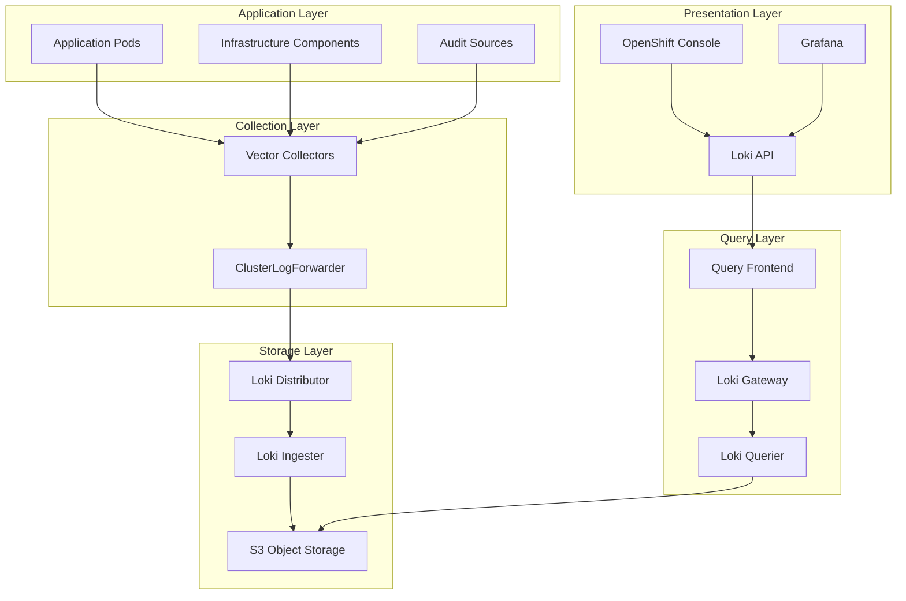
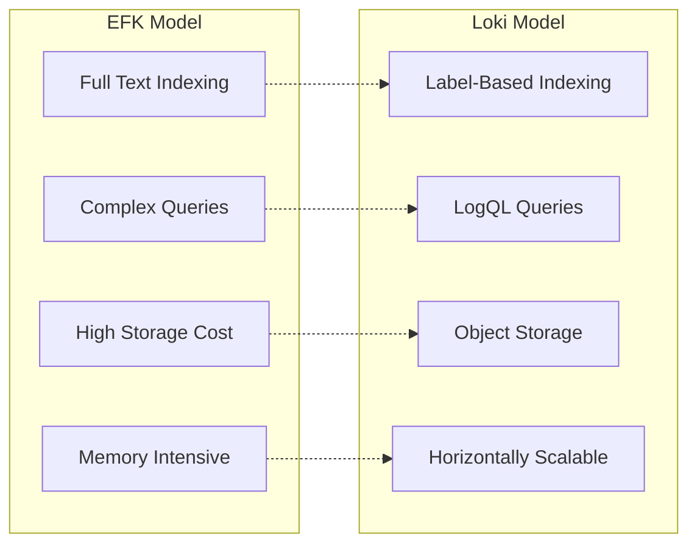
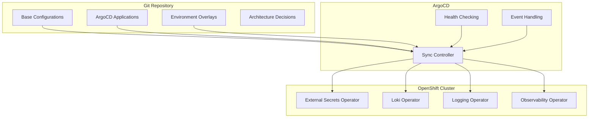
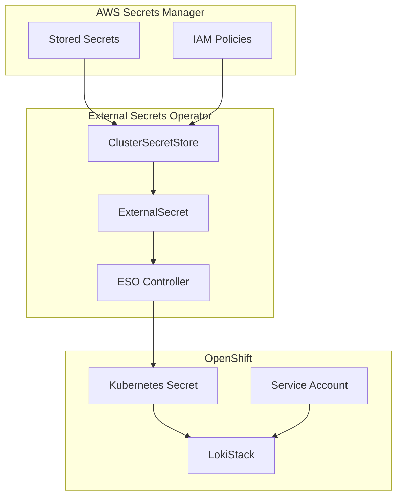
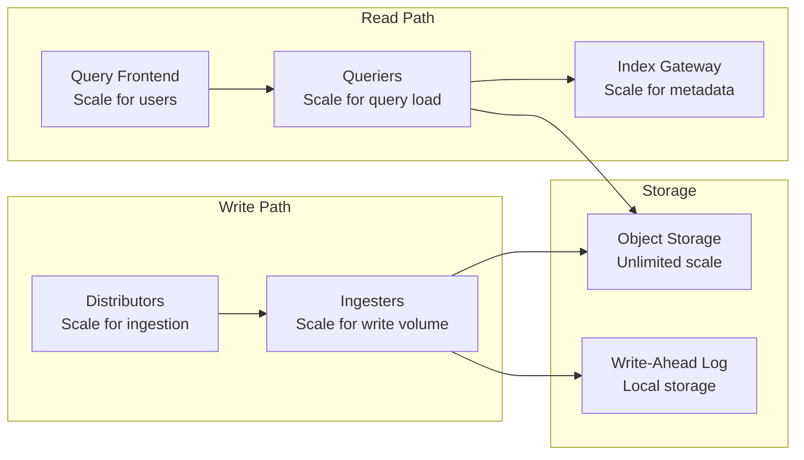
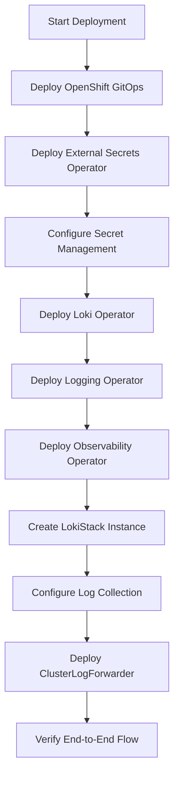

# Understanding OpenShift Logging with Loki and GitOps

This document explains the architectural decisions, design principles, and implementation patterns used in this OpenShift logging deployment. It provides the conceptual foundation for understanding why specific technologies and approaches were chosen.

## Table of Contents

1. [Architectural Overview](#architectural-overview)
2. [Why Loki Over EFK](#why-loki-over-efk)
3. [GitOps Principles](#gitops-principles)
4. [Security Model](#security-model)
5. [Scalability Considerations](#scalability-considerations)
6. [Operational Patterns](#operational-patterns)
7. [Technology Choices](#technology-choices)

## Architectural Overview

### Modern Logging Stack Architecture

This implementation represents a shift from traditional centralized logging to a cloud-native, horizontally scalable architecture based on the following principles:



### Key Architectural Principles

1. **Horizontally Scalable**: Components can scale independently based on load
2. **Cloud-Native**: Designed for containerized, ephemeral environments
3. **Cost-Effective**: Object storage reduces operational costs significantly
4. **Multi-Tenant**: Support for namespace-based log separation
5. **GitOps-Driven**: All configurations managed through Git workflows

## Why Loki Over EFK

The transition from Elasticsearch, Fluentd, and Kibana (EFK) to Loki represents a fundamental shift in logging architecture philosophy.

### Traditional EFK Challenges

**Elasticsearch Issues:**
- High resource consumption (memory and CPU)
- Complex cluster management and maintenance
- Expensive storage requirements for full-text indexing
- Difficult to scale cost-effectively
- Index management overhead

**Operational Complexity:**
- Multiple components with different scaling characteristics
- Complex upgrade procedures
- Resource contention between indexing and querying
- Storage planning difficulties

### Loki Advantages

**Architecture Benefits:**


**Cost Efficiency:**
- Only indexes metadata (labels), not full log content
- Uses cheap object storage (S3) for log data
- Significantly lower memory footprint
- Better resource utilization

**Operational Simplicity:**
- Fewer moving parts
- Simpler deployment and maintenance
- Better compatibility with Kubernetes patterns
- Native Prometheus-style querying

**Developer Experience:**
- LogQL syntax familiar to Prometheus users
- Better integration with observability stack
- Faster time-to-insight for common queries
- More intuitive label-based filtering

## GitOps Principles

### Configuration as Code

Every aspect of the logging infrastructure is defined declaratively:



### Benefits of GitOps Approach

**Reliability:**
- Declarative configuration ensures consistent deployments
- Git history provides audit trail and rollback capability
- Automated drift detection and correction

**Security:**
- All changes go through code review process
- No direct cluster access required for deployments
- Credentials managed through External Secrets Operator

**Collaboration:**
- Infrastructure changes follow software development practices
- Clear approval workflows through pull requests
- Documentation co-located with configurations

**Multi-Environment Support:**
- Consistent deployment patterns across environments
- Environment-specific overlays for customization
- Promotion workflows from dev to production

## Security Model

### Credential Management Strategy

The security model prioritizes least-privilege access and secrets isolation:



### Security Principles

**Secrets Management:**
- No secrets stored in Git repository
- Automatic secret rotation capability
- Granular access controls through IAM
- Audit logging for secret access

**Network Security:**
- TLS encryption for all communications
- Network policies for pod-to-pod communication
- Service mesh integration capabilities
- Secure ingress patterns

**Access Control:**
- RBAC-based access to logging data
- Namespace-based log isolation
- Multi-tenant query patterns
- Integration with OpenShift authentication

## Scalability Considerations

### Horizontal Scaling Architecture

Loki's architecture enables independent scaling of different functions:



### Scaling Patterns

**Ingestion Scaling:**
- Add distributors for higher ingestion rates
- Scale ingesters for write volume
- Vector collectors automatically discover new endpoints

**Query Scaling:**
- Query frontend provides caching and request parallelization
- Queriers can be scaled independently
- Index gateway reduces metadata query load

**Storage Scaling:**
- Object storage provides unlimited capacity
- Retention policies manage costs automatically
- Schema evolution enables optimization over time

### Performance Characteristics

**Write Performance:**
- Streaming ingestion with minimal latency
- Configurable batching and compression
- Automatic backpressure handling

**Query Performance:**
- Label-based indexing enables fast filtering
- Parallel query execution across time ranges
- Caching at multiple layers

**Cost Optimization:**
- Tiered storage with lifecycle policies
- Compression reduces storage costs
- Query-time decompression balances cost and performance

## Operational Patterns

### Deployment Lifecycle

The deployment follows a carefully orchestrated sequence based on dependencies:



### Monitoring and Alerting

**Health Monitoring:**
- Operator-level health checks
- Component-specific metrics
- End-to-end log flow validation
- Resource utilization tracking

**Alerting Strategy:**
- Critical component failures
- Log ingestion rate anomalies
- Storage capacity warnings
- Query performance degradation

### Maintenance Procedures

**Routine Operations:**
- Operator updates through GitOps
- Configuration changes via pull requests
- Capacity planning based on metrics
- Regular backup verification

**Incident Response:**
- Runbook-driven troubleshooting
- Automated rollback capabilities
- Diagnostic data collection
- Post-incident reviews and improvements

## Technology Choices

### Vector vs. Fluentd for Log Collection

**Why Vector:**
- Better performance and lower resource usage
- Native Kubernetes integration
- More flexible routing and filtering
- Rust-based reliability and memory safety
- Better observability and metrics

**Trade-offs:**
- Newer ecosystem compared to Fluentd
- Fewer community plugins available
- Learning curve for teams familiar with Fluentd

### S3 for Log Storage

**Why Object Storage:**
- Unlimited scalability at low cost
- Built-in durability and availability
- Lifecycle management for cost optimization
- Industry-standard APIs and tooling

**Integration Benefits:**
- Native Loki support for S3-compatible storage
- Simplified backup and disaster recovery
- Cross-region replication capabilities
- Integration with existing AWS infrastructure

### Operator-Based Management

**Benefits of Operators:**
- Kubernetes-native management patterns
- Automated lifecycle management
- Self-healing capabilities
- Standardized APIs for configuration

**OpenShift Integration:**
- Certified operators with support guarantees
- Integrated upgrade paths
- Security scanning and vulnerability management
- Enterprise support and documentation

## Design Patterns

### Multi-Tenancy Implementation

```yaml
# Application logs separated by namespace
tenantKey: kubernetes.namespace_name

# Infrastructure logs by component type
tenantKey: log_type
```

### Data Retention Strategy

```yaml
# Configurable retention by tenant
retention:
  days: 30
  streams:
  - selector: '{namespace="production"}'
    days: 90
    priority: 1
  - selector: '{namespace="development"}'
    days: 7
    priority: 2
```

### Query Optimization Patterns

```logql
# Efficient: Label filtering first
{namespace="myapp", pod=~"web-.*"} |= "error"

# Less efficient: Text search without labels
{} |= "error" | json | namespace="myapp"
```

## Future Considerations

### Emerging Technologies

**OpenTelemetry Integration:**
- Unified observability data collection
- Correlation between logs, metrics, and traces
- Standardized instrumentation libraries

**Grafana Ecosystem Evolution:**
- Improved visualization capabilities
- Better integration with alerting
- Enhanced dashboard sharing and management

### Scalability Evolution

**Cloud-Native Storage:**
- Integration with Kubernetes-native storage solutions
- Improved cross-cloud portability
- Better cost optimization strategies

**Edge Computing:**
- Log collection from edge environments
- Hierarchical log aggregation patterns
- Reduced bandwidth requirements

This architectural overview provides the foundation for understanding the design decisions and implementation patterns used in this OpenShift logging deployment. The combination of Loki's efficient architecture, GitOps operational model, and robust security practices creates a modern, scalable, and maintainable logging infrastructure.
